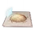
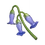
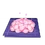

# JSON Paradise

Compilado de teleportes para Genshin Impact feito para reduzir o desperdício de tempo em rotas repetitivas e melhorando a eficiência de sua experiência de jogo.

---
Ultima Atualização: 

---
EN Ver: Em breve.

---

## Sumário
> Sumário com todos os topicos neste post.

- [**Como baixar?**](#como-baixar)
  - [Baixar arquivos individuais](#baixar-arquivos-individuais)
  - [Baixar diretório completo](#baixar-diretório-completo)
  - [Como procurar na pagina?](#como-procurar-na-pagina)
  - [Como usar os tp](#como-usar-os-tps)
- [**Exploração**](#exploração)
  - [Oculis](#oculis)
  - [Especialidades](#especialidades)

# Como baixar?
> /

# Baixar arquivos individuais
> /

# Baixar diretório completo
> /

# Como usar os TPs?
> /

# Como procurar na pagina?
> Pressione "CTRL + F" e digite na caixa oque você quer
>
> Para uma pesquisa com mais precisão não inclua "-"
>
> Por exemplo, pesquise “doce” ou “flor” em vez de “flor-doce”.

# Exploração
-----
## Oculis
> NOTAS:
>
> Atualmente há 150 hydroculos no mapa (Genshin 4.1)
>
> (Por favor ja ter terminado todas as quests da espinha antes) Há 77 calcedônias para pegar no mundo, o resto tem que ser pego no "desejo carmesim" upando a arvore da espinha do dragão
> 
> Há informações extras nos numeros pequenos do lado do nome do item.

| Data da adição    | Icon                                             | Nome               | Região                 | Author  |
| ---------- | ----------------------------------------------------- | --------------------- | --------------------- | ------------- |
| 03/10/2023 |      |[Anemoculus](https://github.com/Gabriel4927/json-paradise/raw/main/download/Anemoculus.rar)        |Mondstadt               | Gabszap |
| 03/10/2023 |          |[Geoculus](https://github.com/Gabriel4927/json-paradise/raw/main/download/Geoculus.rar)          |Liyue                   | Gabszap |
| 03/10/2023 |  |[Electroculus](https://github.com/Gabriel4927/json-paradise/raw/main/download/Electroculus.rar)      |Inazuma                 | Gabszap |
| 03/10/2023 |    |[Dendroculus](https://github.com/Gabriel4927/json-paradise/raw/main/download/Dendroculus.rar)       |Sumeru                  | Gabszap |
| 03/10/2023 |      |[Hydroculus](https://github.com/Gabriel4927/json-paradise/raw/main/download/Hydroculus.rar)        |Fontaine                | Gabszap | 
| 03/10/2023 |      |[Calcedônia Carmesim](https://github.com/Gabriel4927/json-paradise/blob/main/download/CalcedoniaCarmesim.rar) |Espinha do dragão     | Gabszap |
| 03/10/2023 |        |[Espato Lúmen](https://github.com/Gabriel4927/json-paradise/raw/main/download/EspatoLumen.rar)      |Despenhadeiro: subterrâneo | Gabszap |
| 03/10/2023 |     |[Minério Lúmen](https://github.com/Gabriel4927/json-paradise/raw/main/download/MinerioLumen.rar)[^1] |Despenhadeiro: subterrâneo | Gabszap |
| 03/10/2023 |             |[Padrões de chave](https://github.com/Gabriel4927/json-paradise/raw/main/download/Padr%C3%B5es%20de%20chave.rar)[^2] | Enkanomiya             | Gabszap |
| 03/10/2023 |            |[Selo Sagrado](https://github.com/Gabriel4927/json-paradise/raw/main/download/Selo%20Sagrado.rar)      |Sumeru: Deserto            | Gabszap |

# Especialidades
> Especialidades estão separadas por região.
- [Mondstadt](#mondstadt)
- [Liyue](#liyue)
- [Inazuma](#inazuma)
- [Sumeru](#sumeru)
- [Fontaine](#fontaine) (atualizado conforme as expansões)

## Bônus de personagem
> Certos personagens têm Talentos que ajudam a identificar especialidades locais, indicando-os com um ícone de mão no minimapa:

| Icon                        | Nome                        | Região                | Descrição                 |
| ---------------------------------- | --------------------- | --------------------- | --------------------------|
|  | Klee                 | Mondstadt | Mostra a localização de **especialidades de Mondstadt** próximas no mapa.
|  | Mika                 | Mondstadt | Mostra a localização de **especialidades de Mondstadt** próximas no mapa.
|  | Yanfei           | Liyue     | Mostra a localização de **especialidades de Liyue** próximas no mapa.
|      | Qiqi             | Liyue     | Mostra a localização de **especialidades de Liyue** próximas no mapa.
|  | Tighnari        | Sumeru    | Mostra a localização de **especialidades de Sumeru** próximas no mapa.
|  | Nahida          | Sumeru    | Nahida pode usar **Esquemas Universais** para interagir com outros objetos coletáveis dentro de uma certa AdE.
|  | Gorou              | Inazuma   | Mostra a localização de **especialidades de Inazuma** próximas no mapa.
|  | Lyney              | Fontaine  | Mostra a localização de **especialidades de Fontaine** próximas no mapa.

# Mondstadt

| Data da adição | Icon                                         | Nome              | Região     | Author  |
| --------------- | -------------------------------------------- | ------------------ | ---------- | -------- |
| 07/10/2023      |  | [Cecilia](https://github.com/Gabriel4927/json-paradise/raw/main/download/Especialidades/Cecillia.rar) | Mondstadt | Gabszap |
| 07/10/2023      |  | [Cogumelo Philanemo](https://github.com/Gabriel4927/json-paradise/raw/main/download/Especialidades/Cogumelo_Philanemo.rar) | Mondstadt | Gabszap |
| 07/10/2023      |  | [Gancho do Lobo](https://github.com/Gabriel4927/json-paradise/raw/main/download/Especialidades/Gancho_do_lobo.rar) | Mondstadt | Gabszap |
| 07/10/2023      |  | [Lampada de Grama](https://github.com/Gabriel4927/json-paradise/raw/main/download/Especialidades/Lampada_de_grama.rar) | Mondstadt | Gabszap |
| 07/10/2023      |  | [Margaridas Voadoras](https://github.com/Gabriel4927/json-paradise/raw/main/download/Especialidades/Margaridas_Voadoras.rar) | Mondstadt | Gabszap |
| 07/10/2023      |  | [Semente de Dandelion](https://github.com/Gabriel4927/json-paradise/raw/main/download/Especialidades/Sementes_de_dandelion.rar) | Mondstadt | Gabszap |
| 07/10/2023      |  | [Valberry](https://github.com/Gabriel4927/json-paradise/raw/main/download/Especialidades/Valberry.rar) | Mondstadt | Gabszap |

# Liyue

| Data da adição | Icon                                         | Nome              | Região   | Author  |
| --------------- | -------------------------------------------- | ------------------ | -------- | -------- |
| 08/10/2023      |  | [Concha Estrelada](https://github.com/Gabriel4927/json-paradise/raw/main/download/Especialidades/Concha_Estrelada.rar) | Liyue | Gabszap |
| 08/10/2023      |  | [Cor Lapis](https://github.com/Gabriel4927/json-paradise/raw/main/download/Especialidades/CorLapis.rar) | Liyue | Gabszap |
| 08/10/2023      |  | [Flor de Seda](https://github.com/Gabriel4927/json-paradise/raw/main/download/Especialidades/Flor_de_seda.rar) | Liyue | Gabszap |
| 08/10/2023      |  | [Jade Nocticulosa](https://github.com/Gabriel4927/json-paradise/raw/main/download/Especialidades/Jade_Nocticulosa.rar) | Liyue | Gabszap |
| 08/10/2023      |  | [Lirio de Vidro](https://github.com/Gabriel4927/json-paradise/raw/main/download/Especialidades/Lirio_de_Vidro.rar) | Liyue | Gabszap |
| 08/10/2023      |  | [Pimenta de Jueyun](https://github.com/Gabriel4927/json-paradise/raw/main/download/Especialidades/Pimenta_de_Jueyun.rar) | Liyue | Gabszap |
| 08/10/2023      |  | [Qingxin](https://github.com/Gabriel4927/json-paradise/raw/main/download/Especialidades/Qingxin.rar) | Liyue | Gabszap |
| 08/10/2023      |  | [Violeta](https://github.com/Gabriel4927/json-paradise/raw/main/download/Especialidades/Violeta.rar) | Liyue | Gabszap |

# Inazuma

| Data da adição | Icon                                         | Nome              | Região    | Author  |
| --------------- | -------------------------------------------- | ------------------ | --------- | -------- |
| 09/10/2023      |  | [Dendrobio](https://github.com/Gabriel4927/json-paradise/raw/main/download/Especialidades/Dendrobium.rar) | Inazuma | Gabszap |
| 09/10/2023      |  | [Erva Naku](https://github.com/Gabriel4927/json-paradise/raw/main/download/Especialidades/Erva_Naku.rar) | Inazuma | Gabszap |
| 09/10/2023      |  | [Fruto Tenkumo](https://github.com/Gabriel4927/json-paradise/raw/main/download/Especialidades/Fruto_Tenkumo.rar) | Inazuma | Gabszap |
| 09/10/2023      |  | [Fungos Fluorescentes](https://github.com/Gabriel4927/json-paradise/raw/main/download/Especialidades/Fungo_Fluorescente.rar) | Inazuma | Gabszap |
| 09/10/2023      |  | [Fungos Marítimos](https://github.com/Gabriel4927/json-paradise/raw/main/download/Especialidades/Fungo_Maritimo.rar) | Inazuma | Gabszap |
| 09/10/2023      |  | [Medula de Cristal](https://github.com/Gabriel4927/json-paradise/raw/main/download/Especialidades/Medula_de_Cristal.rar) | Inazuma | Gabszap |
| 09/10/2023      |  | [Onikabuto](https://github.com/Gabriel4927/json-paradise/raw/main/download/Especialidades/Onikabuto.rar) | Inazuma | Gabszap |
| 09/10/2023      |  | [Pérola Sango](https://github.com/Gabriel4927/json-paradise/raw/main/download/Especialidades/Perola_Sango.rar) | Inazuma | Gabszap |
| 09/10/2023      |  | [Pétalas da Flor de Sakura](https://github.com/Gabriel4927/json-paradise/raw/main/download/Especialidades/Petalas_de_Sakura.rar) | Inazuma | Gabszap |

# Sumeru

| Data da adição | Icon                                         | Nome              | Região  | Author  |
| --------------- | -------------------------------------------- | ------------------ | ------- | -------- |
| 10/10/2023      |  | [Baga de espinheiro](https://github.com/Gabriel4927/json-paradise/raw/main/download/Especialidades/Baga_de_Espinheiro.rar) | Sumeru | Gabszap |
| 10/10/2023      |  | [Escaravelho dourado](https://github.com/Gabriel4927/json-paradise/raw/main/download/Especialidades/Escaravelho.rar) | Sumeru | Gabszap |
| 10/10/2023      |  | [Flor do luto](https://github.com/Gabriel4927/json-paradise/raw/main/download/Especialidades/Flor_do_Luto.rar) | Sumeru | Gabszap |
| 10/10/2023      |  | [Gordura de pupa de areia](https://github.com/Gabriel4927/json-paradise/raw/main/download/Especialidades/Gordura_de_pupa_de_areia.rar) | Sumeru | Gabszap |
| 10/10/2023      |  | [Lotus kalpalata](https://github.com/Gabriel4927/json-paradise/raw/main/download/Especialidades/Lotus_Kalpalata.rar) | Sumeru | Gabszap |
| 10/10/2023      |  | [Lotus nilotpala](https://github.com/Gabriel4927/json-paradise/raw/main/download/Especialidades/Lotus_Nilotpala.rar) | Sumeru | Gabszap |
| 10/10/2023      |  | [Padirasah](https://github.com/Gabriel4927/json-paradise/raw/main/download/Especialidades/Padisarah.rar) | Sumeru | Gabszap |

# Fontaine
> Atualmente só tem essas especialidades.

| Data da adição | Icon                                         | Nome              | Região   | Author  |
| --------------- | -------------------------------------------- | ------------------ | -------- | -------- |
| 11/10/2023      |  | [Flor Rociomarinha](https://github.com/Gabriel4927/json-paradise/raw/main/download/Especialidades/Romaritime_Flower.rar) | Fontaine | Gabszap |
| 11/10/2023      |  | [Campânula Lumidouce](https://github.com/Gabriel4927/json-paradise/raw/main/download/Especialidades/Canapula_Lumidouce.rar) | Fontaine | Gabszap |
| 11/10/2023      |  | [Rosa Arco-Iris](https://github.com/Gabriel4927/json-paradise/raw/main/download/Especialidades/Rosa_ArcoIris.rar) | Fontaine | Gabszap |
| 11/10/2023      |  | [Lumitoile](https://github.com/Gabriel4927/json-paradise/raw/main/download/Especialidades/Lumitoile.rar) | Fontaine | Gabszap |
| 11/10/2023      |  | [Unidade de Subdetecção](https://github.com/Gabriel4927/json-paradise/blob/main/download/Especialidades/Unidade%20de%20Subdetec%C3%A7%C3%A3o.rar) | Fontaine | Gabszap |

[^1]: Minério Lúmen é usado para upar o nivel da lanterna.
[^2]: Já ter feito todas as missões de enkanomiya antes de ir atras dos padrões de chave. Onde usar os padrões de chave: https://youtu.be/_ES5BTwIp_M?si=IapwxOCtptDzCO-A

